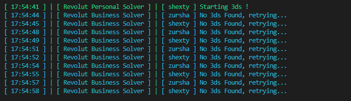
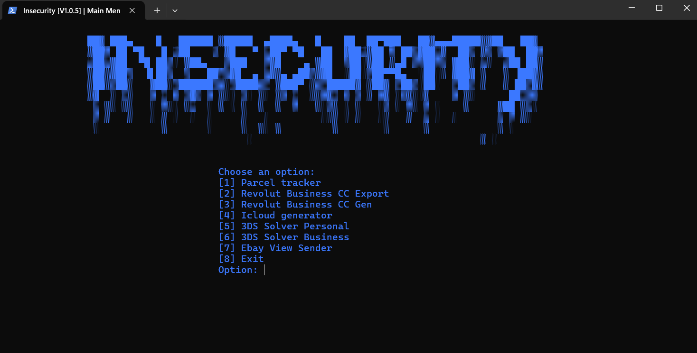

<p align="center">
  
</p>

<p align="center">
  <em>A Python developer passionate about security and automation</em>
</p>

<div align="center">

# 🛡️ Insecurity Multi Tool  
**A Comprehensive Multi-Tool for Cybersecurity & Account Management Tasks**


</div>

---

## 🧠 Overview

**Insecurity Multi Tool** is a modular Python-based toolkit aggregating utilities for cybersecurity, account management, and automation workflows. It emphasizes usability, extensibility, and streamlined operations.

> **Important:** Authorized use only. Misuse of features for fraud or unauthorized access is illegal.

---

## 🌟 Features

- **Parcel Tracker** — Track parcel and shipment statuses from multiple carriers.
- **Revolut Business — Card Export** — Export all cards on your Revolut Business account to an easy-to-read CSV.
- **Revolut Business — Virtual Card Generator** — Automatically generate virtual cards for Business accounts and save to CSV.
- **iCloud Account Provisioning** — Automate creation of iCloud accounts for testing or authorized provisioning.
- **3DS Approval Helper (Personal Accounts)** — Automate handling of 3DS approval prompts for personal accounts you control.

  
  *Screenshot: Revolut Personal 3DS Solver interface*

- **3DS Approval Helper (Business Accounts)** — Similar functionality for Revolut Business accounts.
- **eBay View Sender** — Increase view counts on your own eBay listings for analytics or promotion.

---

## 📊 Dashboard

Visual overview of the **Insecurity Multi Tool** interface and workflow:


*Screenshot: Dashboard interface of Insecurity Multi Tool*

---

## ⚙️ Configuration & Usage

```bash
git clone https://github.com/shexty/Insecurity-multi-tool-.git
cd Insecurity-multi-tool-
python InsecurityV1.0.5.py
```

Follow the interactive menu to select features and provide any required credentials or configuration.

---

## ⚠️ Legal & Ethical Use

- Only use on accounts you own or manage with explicit authorization.
- Do not bypass security or authentication for unauthorized access.
- Misuse may result in legal consequences.

---

## 📁 Project Structure

```
Insecurity-multi-tool/
├── InsecurityV1.0.5.py
├── setup.txt
├── revolut_personal_solver.png
├── dashboard.png
└── README.md
```

---

## 🛠️ Dependencies

- Python 3.x  
- Additional libraries (see comments in the script or `requirements.txt`)

```bash
pip install -r requirements.txt
```

---

## 🤝 Contributing

- Fork → branch → commit → pull request  
- Include tests and documentation for any new modules.

---

## 📜 License

```
MIT License

Copyright (c) 2025

Permission is hereby granted, free of charge, to any person obtaining a copy
of this software and associated documentation files...
```

---

<p align="center">
  🛡 Empowering authorized security workflows — use responsibly.
</p>